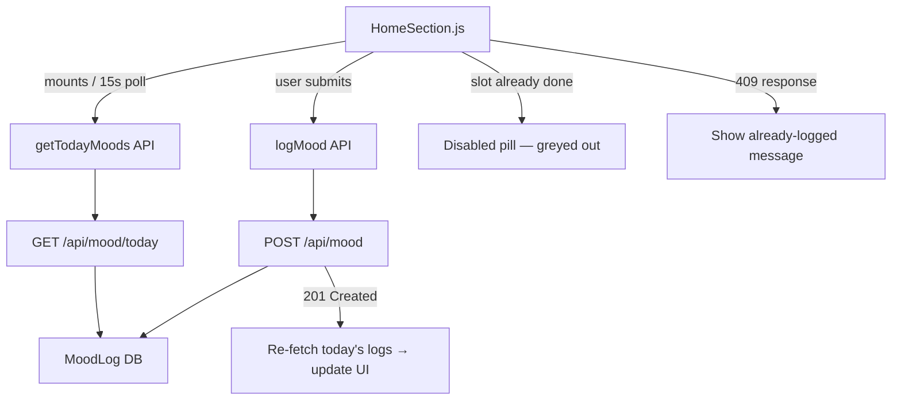
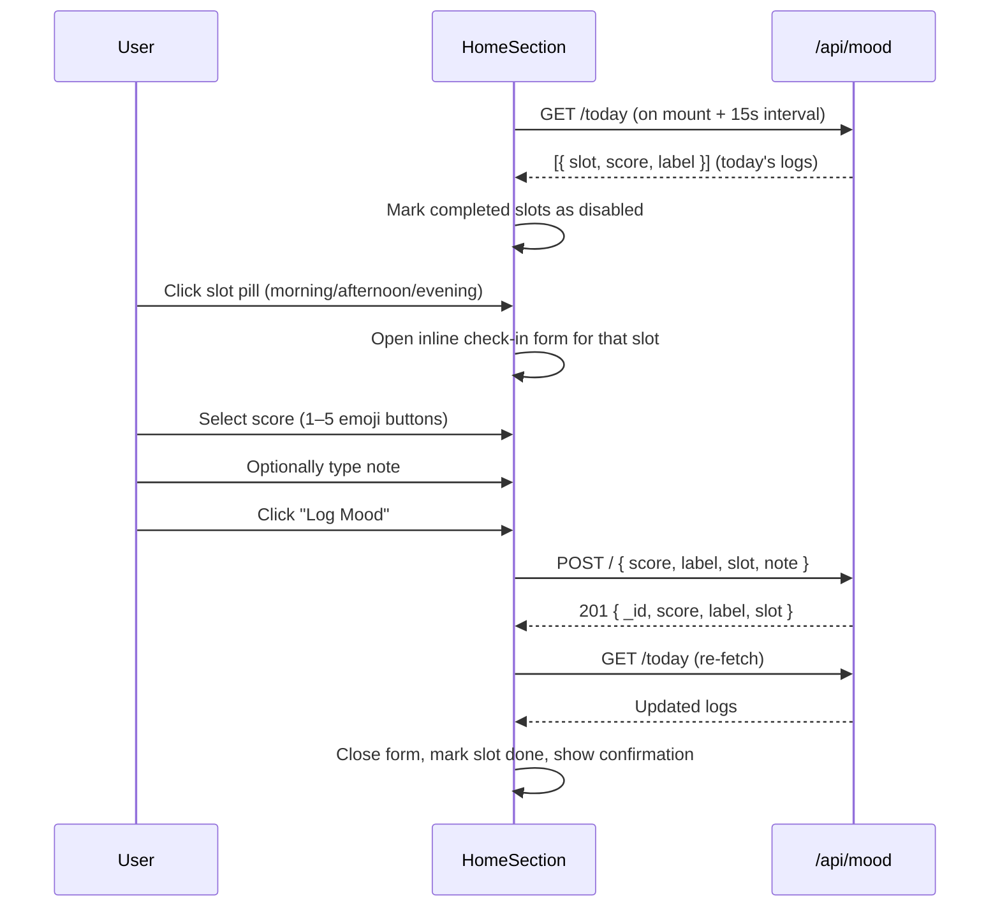

# Design Document: Mood Check-In UI

## Overview

HomeSection.js currently has no mood check-in UI, leaving the health card's mood trend chart permanently empty. This feature adds a daily mood check-in widget to HomeSection.js that lets users log their mood score (1–5) and optional note for each of the three daily slots (morning, afternoon, evening), using the existing `/api/mood` backend endpoints and `logMood` / `getTodayMoods` API client functions.

The widget is self-contained inside HomeSection.js, uses only plain React + inline styles / existing CSS classes (no external UI libraries), and matches the existing dark-theme design system (CSS variables: `var(--surface)`, `var(--border)`, `var(--text-muted)`, etc.).

---

## Architecture





---

## Components and Interfaces

### MoodCheckin (inline component inside HomeSection.js)

**Purpose**: Renders the full check-in widget — slot pills, inline form, and completion state.

**Props**: none (reads/writes via local state + API calls)

**Interface**:

```typescript
interface SlotStatus {
  slot: 'morning' | 'afternoon' | 'evening'
  done: boolean
  score?: number   // 1–5
  label?: string   // 'Very Low' | 'Low' | 'Okay' | 'Good' | 'Great'
}

interface CheckinFormState {
  activeSlot: 'morning' | 'afternoon' | 'evening' | null
  score: number | null       // 1–5, null = not yet selected
  note: string
  submitting: boolean
  error: string | null
}
```

**Responsibilities**:
- Fetch today's logs on mount and every 15 seconds (shared interval with existing stats fetch)
- Determine current time slot to highlight as "suggested"
- Render three slot pills; disable pills for already-logged slots
- Show inline form when a slot pill is clicked (not a modal — inline expansion)
- Submit via `logMood({ score, label, slot, note })`
- Handle 409 (already logged) gracefully
- Re-fetch today's logs after successful submission

---

## Data Models

### Slot Pill Display

```typescript
const SLOTS = [
  { key: 'morning',   icon: '🌅', label: 'Morning',   timeHint: '5 AM – 12 PM' },
  { key: 'afternoon', icon: '☀️',  label: 'Afternoon', timeHint: '12 PM – 6 PM' },
  { key: 'evening',   icon: '🌙', label: 'Evening',   timeHint: '6 PM – 12 AM' },
]
```

### Score → Label Mapping

```typescript
const SCORE_LABELS: Record<number, string> = {
  1: 'Very Low',
  2: 'Low',
  3: 'Okay',
  4: 'Good',
  5: 'Great',
}

const SCORE_EMOJIS: Record<number, string> = {
  1: '😞',
  2: '😔',
  3: '😐',
  4: '🙂',
  5: '😄',
}
```

### Current Slot Detection

```typescript
function getCurrentSlot(): 'morning' | 'afternoon' | 'evening' {
  const h = new Date().getHours()
  if (h >= 5 && h < 12)  return 'morning'
  if (h >= 12 && h < 18) return 'afternoon'
  return 'evening'   // 18–23 and 0–4 (midnight maps to evening)
}
```

---

## Algorithmic Pseudocode

### Main Check-In Flow

```pascal
PROCEDURE handleSlotClick(slot)
  INPUT: slot ∈ { 'morning', 'afternoon', 'evening' }

  IF todayLogs contains entry with slot = slot THEN
    RETURN  // pill is disabled, click is no-op
  END IF

  IF activeSlot = slot THEN
    SET activeSlot ← null  // toggle close
    RETURN
  END IF

  SET activeSlot ← slot
  SET score ← null
  SET note ← ''
  SET error ← null
END PROCEDURE

PROCEDURE handleSubmit()
  PRECONDITION: activeSlot ≠ null AND score ≠ null

  SET submitting ← true
  SET error ← null

  label ← SCORE_LABELS[score]

  TRY
    CALL logMood({ score, label, slot: activeSlot, note })
    CALL fetchTodayLogs()   // re-fetch to update pill states
    SET activeSlot ← null
  CATCH err
    IF err.response.status = 409 THEN
      SET error ← 'Already logged for this slot today'
      CALL fetchTodayLogs()  // sync state in case of race condition
    ELSE
      SET error ← 'Something went wrong. Try again.'
    END IF
  FINALLY
    SET submitting ← false
  END TRY
END PROCEDURE
```

**Preconditions for handleSubmit:**
- `activeSlot` is one of the three valid slot values
- `score` is an integer in [1, 5]
- User is authenticated (JWT present in localStorage)

**Postconditions:**
- On success: `todayLogs` contains a new entry for `activeSlot`; `activeSlot` resets to null
- On 409: `todayLogs` is re-fetched; error message shown; form stays open
- `submitting` always resets to false in finally block

---

## Key Functions with Formal Specifications

### fetchTodayLogs()

```pascal
PROCEDURE fetchTodayLogs()
  OUTPUT: updates todayLogs state

  logs ← AWAIT getTodayMoods()
  SET todayLogs ← logs.data
END PROCEDURE
```

**Preconditions**: User is authenticated  
**Postconditions**: `todayLogs` reflects the server's current state for today; at most 3 entries (one per slot)

### isSlotDone(slot, todayLogs)

```pascal
FUNCTION isSlotDone(slot, todayLogs)
  INPUT: slot ∈ { 'morning', 'afternoon', 'evening' }, todayLogs: MoodLog[]
  OUTPUT: boolean

  RETURN todayLogs.some(log => log.slot = slot)
END FUNCTION
```

**Postconditions**: Returns true iff a log for that slot exists in today's logs

---

## Example Usage

```jsx
// Inside HomeSection return JSX, between hero and pillars sections:
<MoodCheckinWidget
  todayLogs={todayLogs}
  onLogSuccess={fetchTodayLogs}
/>

// Slot pill — done state
<button disabled style={{ opacity: 0.5, cursor: 'not-allowed' }}>
  🌅 Morning ✓
</button>

// Slot pill — active (form open)
<button style={{ borderColor: 'rgba(99,102,241,0.6)', background: 'rgba(99,102,241,0.12)' }}>
  ☀️ Afternoon
</button>

// Score selector
{[1,2,3,4,5].map(n => (
  <button key={n} onClick={() => setScore(n)}
    style={{ background: score === n ? 'rgba(99,102,241,0.3)' : 'var(--surface)' }}>
    {SCORE_EMOJIS[n]} {SCORE_LABELS[n]}
  </button>
))}
```

---

## Correctness Properties

1. **No duplicate slot submission**: A slot pill is disabled (non-clickable) once `isSlotDone(slot, todayLogs)` returns true. The backend also enforces this with a 409.

2. **Score required before submit**: The "Log Mood" button is disabled (`disabled={!score || submitting}`) until a score is selected.

3. **State consistency after 409**: On a 409 response, `fetchTodayLogs()` is called to sync local state with server state, preventing the UI from showing a slot as available when it's already logged.

4. **Slot detection accuracy**: `getCurrentSlot()` maps hours 0–4 to `'evening'` (midnight maps to evening per spec), 5–11 to `'morning'`, 12–17 to `'afternoon'`, 18–23 to `'evening'`.

5. **No UI library dependency**: All styling uses inline styles with CSS variables (`var(--surface)`, `var(--border)`, `var(--text-muted)`) or existing CSS classes from index.css.

6. **Health card chart population**: After a successful `logMood` call, the health card's `GET /healthcard/me` will include the new log in `moodLogs`, making the MoodChart render data points.

---

## Error Handling

### Scenario 1: Slot already logged (409)

**Condition**: User somehow submits for a slot already logged today (race condition or stale UI)  
**Response**: Show inline error message "Already logged for this slot today." Re-fetch today's logs to update pill state.  
**Recovery**: Pill becomes disabled; form closes on next interaction.

### Scenario 2: Network error

**Condition**: `logMood` call fails with non-409 error  
**Response**: Show inline error "Something went wrong. Try again." Keep form open.  
**Recovery**: User can retry; submitting state resets to false.

### Scenario 3: `getTodayMoods` fails on mount

**Condition**: Initial fetch fails (server down, auth expired)  
**Response**: `todayLogs` stays empty array; all slots appear available. No crash.  
**Recovery**: Polling retries every 15 seconds.

---

## Testing Strategy

### Unit Testing Approach

- `getCurrentSlot()`: test all hour boundaries (0, 4, 5, 11, 12, 17, 18, 23)
- `isSlotDone()`: test with empty array, partial array, full array
- Score→label mapping: verify all 5 entries

### Property-Based Testing Approach

**Property Test Library**: fast-check

- For any `todayLogs` array with 0–3 entries, `isSlotDone` returns true iff the slot appears in the array
- For any hour h ∈ [0, 23], `getCurrentSlot` returns one of the three valid slot strings
- Submitting with score ∈ [1,5] always produces a valid label from SCORE_LABELS

### Integration Testing Approach

- Mock `logMood` to return 201; verify `getTodayMoods` is called after success
- Mock `logMood` to return 409; verify error message shown and `getTodayMoods` re-fetched
- Verify slot pill becomes disabled after successful log

---

## Performance Considerations

- Today's logs are fetched on mount and polled every 15 seconds — same interval as the existing stats poll in HomeSection. No additional polling overhead.
- The widget adds no new API endpoints; it reuses existing `/api/mood/today` and `POST /api/mood`.

---

## Security Considerations

- All mood API calls require JWT (enforced by `authMiddleware` on the server). The API client auto-attaches the token from localStorage.
- No user PII is displayed in the widget — only the logged-in user's own mood data.

---

## Dependencies

- `logMood`, `getTodayMoods` — already exported from `client/src/api/auth.js`
- `useState`, `useEffect`, `useCallback` — already imported in HomeSection.js
- No new npm packages required
